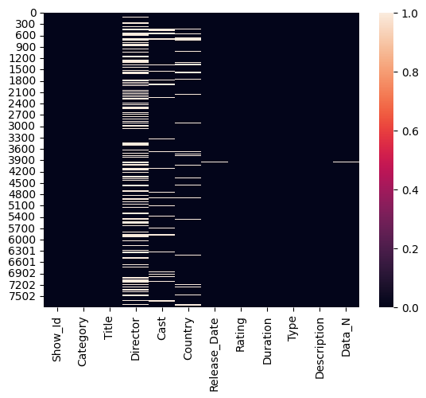
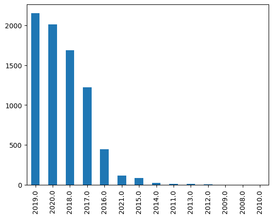
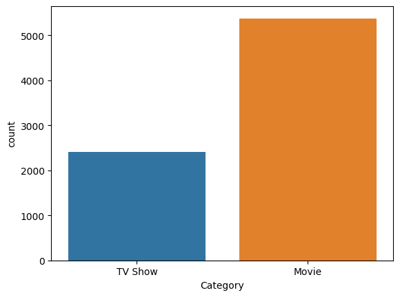
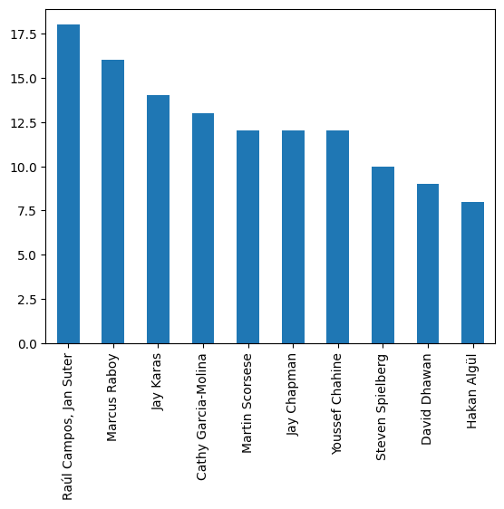
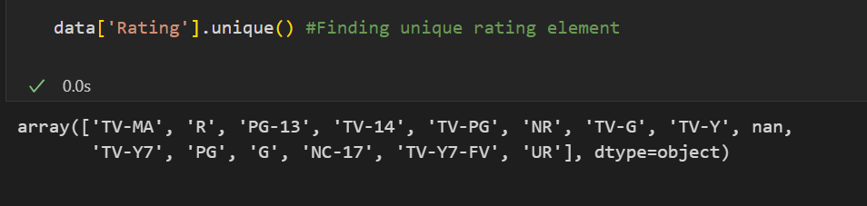
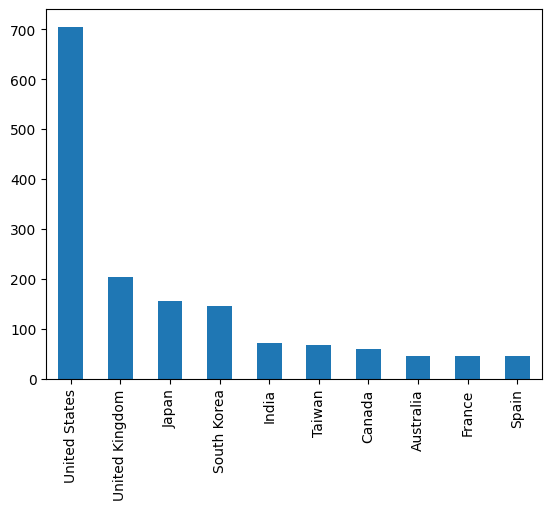

# Netflix Data Exploratory Analysis

## Project Overview
This project presents a comprehensive exploratory data analysis (EDA) of Netflix's content. The dataset was meticulously cleaned to ensure accuracy, including the removal of duplicates and handling of missing values.

A heatmap was generated to visualize the distribution of null values, revealing that the 'Director', 'Cast', and 'Country' fields had the highest incidence of missing data.

## Questions Addressed
The analysis aimed to answer several pertinent questions about Netflix's content distribution and characteristics:
- **Highest Number Of Shows Released Per Year**: A graph was created to visualize the trend of content release over the years.

- **Total Number Of TV Shows AND Movies**: A comparative graph was generated to show the proportion of TV shows to movies on Netflix.

- **Check Movie Released In A Particular Year**: The dataset was queried to filter movies released in a specified year.

- **List of TV Shows Released For A Particular Country**: A breakdown of TV shows available from a specific country was compiled.
- 
- **Max of TV Shows Released for Top Four Countries**: An analysis was conducted to identify the top four countries with the highest number
 of TV show releases.

- **Top Ten Directors**: A graph showcasing the top ten directors with the most content on Netflix was created.

- **Types Of Ratings Given to Movies**: The variety of movie ratings was explored, along with identifying movies with a particular rating.

- **Country with Maximum Duration of TV Shows**: A graph was produced to highlight the country with the longest cumulative duration of TV shows.

## Data Cleaning and Preprocessing
The initial phase of the project involved data cleaning and preprocessing to ensure the integrity of the analysis. This process included:
- Removing duplicate entries.
- Handling null values strategically.
- Identifying fields with the most missing data to inform potential data collection improvements.

## Visualizations
The repository includes a series of visualizations that were instrumental in uncovering insights from the Netflix dataset. These visualizations are crucial for understanding the dynamics of content distribution on the platform.
We came to following analysis from the above exploratory data analysis that we did:-
- With Each Year There has been increased in number of number of shows released
- There is more movies released compared to TV Shows 
- We were able to find the list of movies released in India
- We also were able to deduce that maximum TV Show released every year is increasing with United State being the top followed by United Kindom South Korea and Japan.
- We were able to deduce the TOP Ten Director in TV Shows 
- We were able to deduce diffrent Types of Rating Given For a show.
- We deduced that the maximum duration of TV Show is released in United States.

## Installation and Usage
To run the analysis notebooks, clone this repository and ensure you have Python and the following libraries installed:
- Pandas
- Matplotlib
- Seaborn

